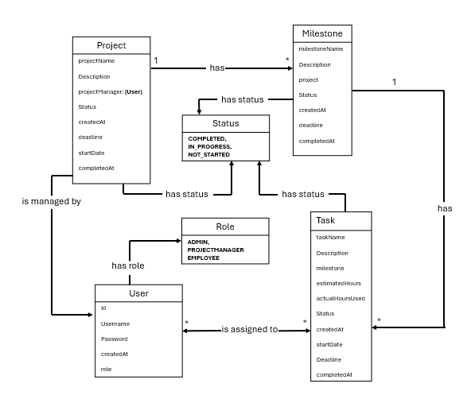
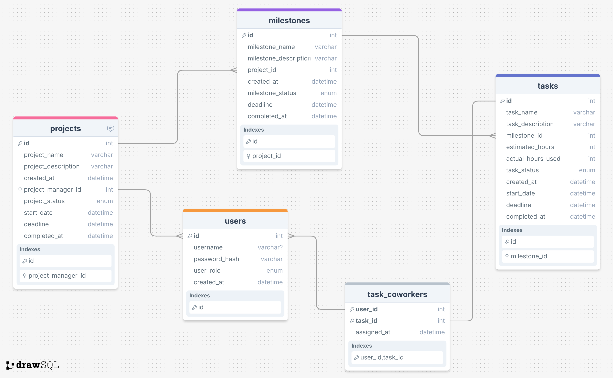

## AlphaManager - ProjectKalkulation-Eksamen

### 📋 About

**AlphaManager** is a project calculation tool built for AlphaSolutions.
The functionality of *AlphaManager* provides the user an insight in the projects, milestones, tasks and employees at the
Alpha Solutions workplace.

This project was developed as part of an exam assignment in the AP Degree in Computer Science at KEA (Copenhagen School
of Design and Technology).


___ 

### 👥 Target audience

Staff members of AlphaSolutions:

- **Admin** - manages user profiles and roles
- **Project Manager** - manages projects, milestones, tasks, and assigns tasks for employees
- **Employee** - logs the amount of time spent on a task

---

### 🚀 Features

Login system that redirects the user to the dashboard with functionality based on the user's role.

**Admin Role is permitted to**:

- *View* all users, projects, milestones and tasks
- *Create* a new user with a specific role
- *Update* a user's username, password and role
- *Delete* a user

**Project Manager Role is permitted to**:

- *View* all users, projects, milestones and tasks
- *View* projects created by project manager
- *Create* a new project, milestone or task
- *Update* a project, milestone or task
- *Delete* a project, milestone or task
- *Assign* tasks to employees

**Employee Role is permitted to**

- *View* all users, projects, milestones and tasks
- *View* assigned work
- *Log* actual hours used on a task assigned to the employee

**Progress tracking**:

- The program calculates task's total hours worked on vs the estimated time to be worked on.
- Milestones estimated hours and total hours spent are calculated based on the milestone's assigned tasks total hours.
- Projects estimated hours and total hours spent are calculated based on the project's assigned milestones total hours.
- The progress will be calculated in percentage.

### 🧠 Domain Model

Below is a domain model for our projecture, that gives an insight in the relationships between the core entities of AlphaManager:


___ 

### 🔐 Security

-- All passwords are encrypted (hashed) through `BCryptPasswordEncoder`

-- Devs must generate a hashed password using `BCryptPasswordEncoder`, then insert the admin user into your local SQL
database manually.

-- Only users with ADMIN role can register users.

-- **Access Denied** exception will be thrown in case, the user tries to access endpoints without an active session, or
with a session that lacks the necessary permissions

-- Custom exception handling in the **GlobalExceptionHandler** ensures redirection when requests are unauthenticated.

___

### 🛠️ Technologies Used

- Java 21
- Maven – Build and dependency management
- Spring Boot – Backend framework
- Spring JDBC – Database access via `JdbcTemplate`
- SQL – Relational database
- H2 – In-memory test database
- Spring Security – Authentication & session handling (`BCryptPasswordEncoder`)
- Spring MVC – Model-View-Controller architecture
- Thymeleaf – Frontend templates
- JUnit 5 – Unit testing
- Mockito – Mocking framework for testing
- Global Exception Handling – Using `@ControllerAdvice`
- DTOs – For drawing a clear line between view models and domain models
- GitHub Actions – Continuous Integration (CI)
- IntelliJ IDEA – Recommended IDE
- Azure App Service – Cloud hosting
- Azure SQL Database – Production database

___

### Setup

1. **Pull the latest code from main**
   ```bash
   git checkout main
   git pull origin main
   ```

2. **Create a new feature branch**
   ```bash
   git checkout -b feature/my-feature
   ```

3. Run and test the project (`mvn clean install`)

4. Generate a hashed password using `BCryptPasswordEncoder`, then insert the admin user into your SQL database manually.
   This is done for the purpose of testing.

5. Write tests for any new features.

6. Open a pull request and describe your changes and new functionality.

### 🌐 Access the application locally

You can access the application locally inserting the following URL in your browser:

```
http://localhost:8080
```

#### ✅ Make sure:

- The local sql environmental values is set in your configurations.
- Login input must match an existing user in the local database.
- If you do not already have an admin user insert this in your main application:

```java
public static void main(String[] args) {
    BCryptPasswordEncoder encoder = new BCryptPasswordEncoder();
    System.out.println(encoder.encode("your-password"));
}
```

Then insert the hashed password in sql:

```sql
INSERT INTO users (username, password, role)
VALUES ('admin', '[hashed-password]', 'ADMIN');
```

Now you are ready to use AlphaManager!

___

### 📁 Folder Structure:

```
projektkalkulation-eksamen/
├── .github/                      # GitHub config (f.eks. workflows)
├── .idea/                        # IntelliJ projektfiler
├── .mvn/                         # Maven wrapper
├── src/
│   ├── main/
│   │   ├── java/com.example.projektkalkulationeksamen/
│   │   │   ├── comparators/      # Custom comparators
│   │   │   ├── controller/       # Spring MVC controllers
│   │   │   ├── dto/              # Data Transfer Objects
│   │   │   ├── exceptions/       # Custom exceptions & global handling
│   │   │   ├── mapper/           # Manual mapping between models and DTOs
│   │   │   ├── model/            # Domain models / entities
│   │   │   ├── repository/       # JDBC repositories
│   │   │   ├── service/          # Business logic
│   │   │   ├── validation/       # Custom validators
│   │   │   └── ProjektKalkulationEksamenApplication.java # Main class
│   │   └── resources/
│   │       ├── sql/              # SQL init scripts
│   │       │   └── init.sql
│   │       ├── static/           # Static assets (CSS, JS, images)
│   │       ├── templates/        # Thymeleaf templates
│   │       ├── application.properties
│   │       ├── application-local.properties
│   │       └── application-azure.properties
│
│   └── test/
│       ├── java/com.example.projektkalkulationeksamen/
│       │   ├── controller/       # Controller tests
│       │   ├── e2e/              # End-to-end tests
│       │   ├── integration/      # Integration tests
│       │   ├── unit/             # Unit tests
│       │   └── ProjektKalkulationEksamenApplicationTests.java
│       └── resources/
│           ├── application.properties
│           └── h2init.sql
│
├── pom.xml                       # Maven project config
├── mvnw / mvnw.cmd               # Maven wrapper scripts
├── .gitignore
├── README.md
└── CONTRIBUTING.md
...
```

___

### ✅ Test Guidelines

- To run all tests, use:
  ```bash
  mvn test
  ```

- Testing must be written when implementing new features.
- Use `@Mock` and `@InjectMocks`
- Test classes belong in `src/test/java` directory.
- Use **H2 in-memory database** for **integration** tests and **end to end** tests, to avoid errors in production
  database.

___

## 🗄️ Database

The project uses two database setups:

### 🔧 Development / Testing

- **H2** in-memory database is used for **Integration tests** and **End to End** tests.
- Configured automatically through `application.properties` in `src/test/resources`.
- `h2init.sql` is located in `src/test/resources`.

### 🌐 Production

- **Azure SQL Database** is used for deployment.
- Connection properties are stored in `application-azure.properties`.

### 💡 Notes

- Access to database is done through **Spring JDBC** (`JdbcTemplate`).
- To test the code, devs must generate a hashed password using `BCryptPasswordEncoder`, then insert the admin user into
  the local SQL
  database manually.

### 📂 SQL files

- `src/main/resources/sql/init.sql` - for development
- `src/test/resources/h2init.sql` - for tests

### 🗺️ Er Diagram
Belov is an overview of the database schema, that provides an understanding of the relational structure of the database used in AlphaManager:


___ 

### 📄 License / Contributing

See [CONTRIBUTING.md](./CONTRIBUTING.md) for contribution guidelines.  
This project was created for educational purposes only.

___

### 👥 Authors / Group

**Group MRV**

GitHub Profiles:

- [MartinMD-Git](https://github.com/MartinMD-Git)
- [rassbiehl](https://github.com/rassbiehl)
- [VictorIrmand](https://github.com/VictorIrmand)
